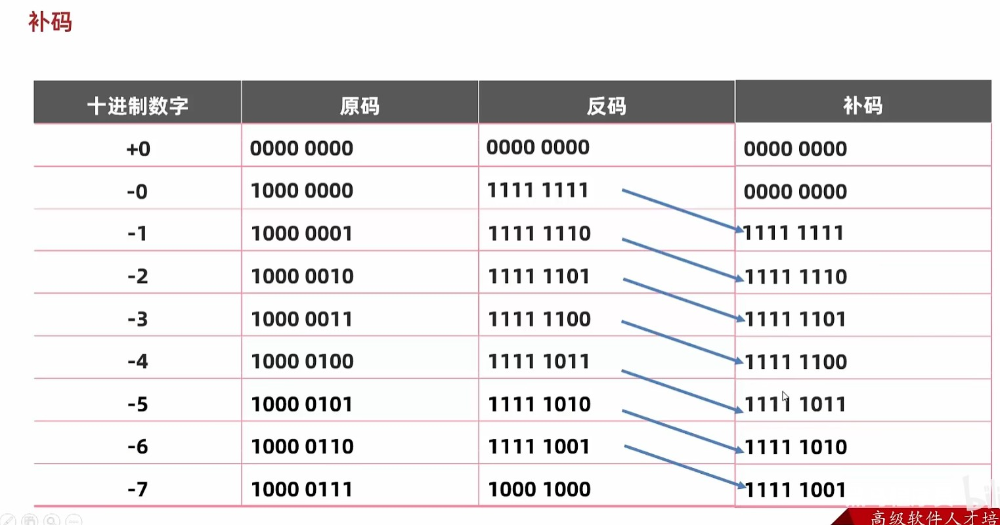
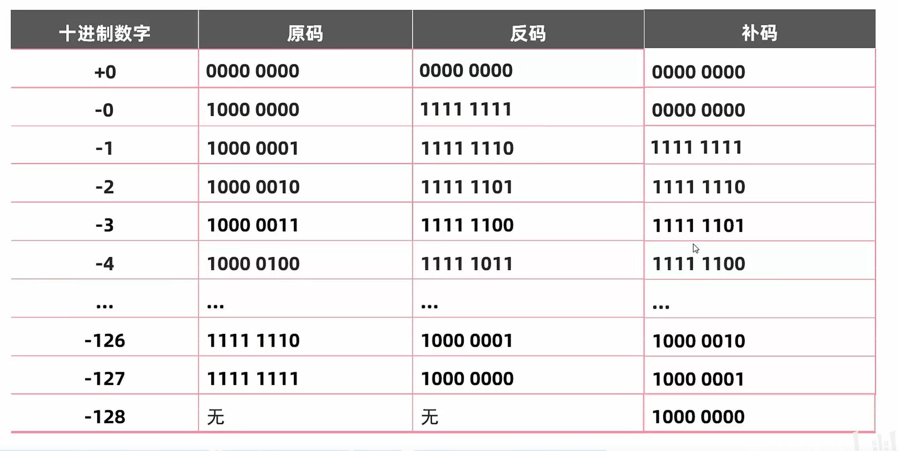

javaSE是桌面应用开发，其他两个版本的基础。CandC++比Java更有桌面开发的优势。javaSE是javaEE基础。

javaME 移动设备主要使用

javaEE web  浏览器+服务器就是java的战场。java,go可以承载巨大的访问量。

编译型语言 整体翻译。Java,c都会产生一个整体翻译后的新文件。
解释型语言 一行一行翻译。Python不会产生新文件

Java的跨平台实际上是通过虚拟机完成的。这个虚拟机是Java为我们提供了现成的。

JDK：开发代码需要的东西：JVM（虚拟机）核心类库，比如System，Java帮我们写好的库。开发工具。
javac 编译工具
java 运行工具
jdb 调试工具
jhat 内存分析工具

JRE:JVM+核心类库+运行工具

JDK包含JRE。JRE包含JVM


Project: MISUMI EC Site https://jp.misumi-ec.com/
从几十年前的 php 版本切换到 Next/React 版，追加各种新功能，各国/移动端对应等等
基本上分为商品选定导线（主要是 ssr 页面展示商品信息）和注文导线（主要 csr 页面，登録/見積/注文/カートなど）

Tech Stack: Next.js/Vercel/Typescript (React/Redux/styled-components/css-modules/React Hook Form)


面试问题

1. 自己紹介
2. 根据项目经验提问（我被问到的和这个项目相关的有 i18n 和性能优化）
3. React/Vue/Nextの評判
4. Github package経験
5. リクエストライブラリが何を使ってます
6. 注目してる技術
7. Agile/Scrum経験（経験あればSprint周期どれくらい）
8. Redux経験、理解
9. CSS Module と styled-component
10. （英語で説明）Next.js’s Server Side vs. Client Side Component
11. よく使ってるReact Hooks、useMemo/useEffect区別
12. よいソースコートはなんですか
13. 品質の良いシステムはなんですか

class就相当于人的细胞。
关键字都是小写。

1. 整数 
2. 小数
3. 字符串 "abc","",
4. 字符 'a','我','0'
5. 布尔值
6. 空 null,null是不能被直接打印的，我们如果想要打印null必须要以"null"形式，这个其实还是字符串

```java
public class HelloWorld{
    public static void main(String[] args){
        System.out.println("abc"+'\t')//"\t"也可以，会把整个字符串补充到8的倍数。abc是3，那么此时\t是5.我们可以利用制表符，来对其我们的打印s。可以让我们的字符串类似表格一样对齐，所以叫制表符。制表符只和他前面的字符串有关系。
    }
}
```

int 整数
double 小数
int n=5;//不同于TS，没有const let var这种。
int a=1,b=2,c=3;

0 0B 0X 分别是8进制 2进制 16进制开头

基本数据类型

1. 整数 byte short int long 
   byte -128-127  short5位  int10位数 long19位
2. 浮点数 （小数 float double
3. 布尔值 boolean
4. 字符 单引号那玩意 char
复杂数据类型

```java
byte b=50;
```

javac编译java后缀文件。 然后java运行class

java HelloWorld  必须要这样才能cmd运行

```
.\HelloWorld.java:3: 错误: 整数太大
        long b=9999999999;
               ^
1 个错误

解决方案
在数字最后面加上L或者l，推荐L。因为l和1非常像。
long b=9999999999L;


这两个代码在Java中的区别在于数值的类型声明。

long b = 9999999999;: 这行代码会导致编译错误，因为9999999999是一个超出int类型范围的整数字面量。默认情况下，整数字面量被解释为int类型。因此，此行代码会引发编译器错误，因为无法将int类型的值赋给long类型的变量b。要解决这个问题，可以在整数字面量后面添加"L"或"l"后缀，将其显式声明为long类型。

long b = 9999999999L;: 这行代码是正确的。通过在整数字面量后添加"L"或"l"后缀，将其显式声明为long类型。这样，编译器就知道将整数字面量解释为long类型，并将其赋值给变量b。

需要注意的是，在Java中，long类型的整数字面量默认是int类型，如果超出int范围，需要显式声明为long类型，以免编译错误。
```


float同理，数字后面加上F或者f

double就不需要加上后缀了。

#### 取值范围

double>float>long>int>short>byte

Scanner可以监测键盘事件


project,module,package,class。项目的层级


整数计算只能得到整数，比如10/3=3。我们只能10.0/3得到小数。


JAVA中数据类型不一样时候进行运算，需要转换成一样的类型才能够进行后续的运算。

int a=10;

double b=20.0;

c=a+b;

隐式转换（自动类型提升）：把取值范围小变成取值范围大

强制转换：反过来

int a=10;

double b=a; 这里就是隐式转换。a自动变成10.0，注意哦，是a被提升了！


byte short char进行运算时候，会先被提升成为int，然后再运算。这是一个小坑点

byte a=10;

byte b=15;

c=a+b; aとbは同時にint型に変換されました。c是int类型


在这两个句子中，区别在于使用的助词。

1. "aとbは同時にint型に変換されました。"
   这句话使用的是助词"に"，表示被转换的目标是"int型"。
2. "aとbは同時にint型と変換されました。"
   这句话使用的是助词"と"，表示a和b同时被转换，并且转换的结果是"int型"。

两个句子的基本含义是相同的，都是表达a和b同时被转换成了int类型。但是，第二个句子使用了"と"助词来表示转换的同时性质，强调了a和b同时进行转换的动作。


"同時に"和"一緒に"是两个表示"同时"的日语表达方式，它们的区别如下：

1. 同時に (どうじに)
   "同時に"强调的是动作或事件在同一时间内同时发生。它用于描述两个或多个动作在相同的时间点上同时发生。这个词通常用于强调时间的一致性和同时性。
2. 一緒に (いっしょに)
   "一緒に"强调的是两个或多个人或物在同一时间、地点或情况下共同存在或共同进行某个动作。它用于描述人们或物体彼此之间的共同性和联合行动。

总而言之，"同時に"侧重于强调时间上的同时性，而"一緒に"则侧重于强调共同性和联合行动。在具体使用时，选择哪个词取决于你想要强调的方面和上下文。


複数のデータが同時にされた場合は、これたちはまずに


#### 字符的+运算

一个字母，单引号就是字符。

1+'a';//值就是98因为小写a是97，注意这里是单引号！

'a'+"a";这里就是aa，因为这里的+是字符串拼接。


#### 自增自减运算符

c++ 我们记住一个口诀c++他比较急，先急着去用，然后再自增。所以说c++的人都比较慌慌张张。

++c就是我，不慌不忙，先自增，再运算。


#### +=

这里和ts有很大的不同点

short a=1;

a+=2;//不仅仅只是a=a+2; 而是这个玩意！a=(short)(a+2)

这里会有一个强制转换，因为a类型是short，那么+=最后就会强制转换成short。这里如果2是一个变量的话，一样的，还是强制转换成short。其他的加减乘除%都同理。

#### 逻辑运算符

&|!这个都是TS具有的。^这个是单独的，相同为false,不相同为true.

idea中，ctrl+d是向下copy一行


#### 原码，反码

01111111表示127

11111111表示-127，第一位表示的是正数或者负数，并且称为 符号位。反码はどのような過程で変わられていますか？符号位が変わっていませんが、その他の全部の数字が反転させています

-56原码：10111000

-56反码：11000111

使用-4原码去+1最终会得到-5的原码

使用-4的反码+1最终会得到-3的反码。

总结：反码用于负数的计算

-0反码是11111111

+0反码是00000000（正数の反码は自分こそです）问题出现了！-0+1会得到+0！！！

问题总结：一旦计算结果跨零了！就会出bug。比如 -5+6结果是0，这不就出bug了。bug就是0被当成了-0和+0被计算了两次！！！



也就是说-1的补码使用的就是-0的反码。

-7的补码使用的就是-6的反码。

-0的补码就是+0的原码。 

正数的原码反码补码都是一样的。



byte  short int long分别占用字节1,2,4,8个字节。


数字计算中没有&&，只有&，|也是。


移出去的数字就不要了。

左移一次就是乘以2.

右移有点点不同。右移后，如果这个数本来是正数，高位补0，如果是负数，高位补1.移出去的同样不要了。补位需要注意，只补第一个多出来的那位数字，其他多出来的都是0.也就是正负数要保持一致，其他的都是补0.

无符号右移：>>>

向右移动，高位全部补0，也就是说他不同于普通右移，他不区分正负数。

#### switch

表达式里面匹配的值：byte,short,int,char。

JDK5之后可以枚举。JDK7以后可以String

case后面的值必须是字面量，不可以是变量！case后面的值不可以重复。

不同于if else，switch的default很像else，但是default可以放在上面也可以写在代码最后面，一般写在最后面，这样便于代码阅读。

swtich里面的case里面必须要写break,不然会有switch穿透，代码不停，还会继续往下执行（也叫case穿透）。Switch逻辑就是遇到break或者大括号才会停止。default我们可以理解成特殊的case。

#### switch新特性

jdk12才有的。

```java
        int num=50;
        switch (num){
            case 10 ->{
                System.out.println("匹配10");
            }case 20 ->{
                System.out.println("匹配20");
            }case 50 ->{
                System.out.println("匹配50");
            }default -> {
                System.out.println("输入有误");
            }
        }
这种写法不会case穿透，并且如果{}只有一句代码，那么{}可以被省略。
```


```java
package com.whc;

import java.util.Scanner;

public class compareoperator {
    public  static  void  main(String[] args){
        int num=50;
        switch (num){
            case 10 ->{
                System.out.println("匹配10");
            }case 20 ->{
                System.out.println("匹配20");
            }case 50 ->{
                System.out.println("匹配50");
            }default -> {
                System.out.println("输入有误");
            }
        }
        Scanner sc=new Scanner(System.in);
        System.out.println(true^false^false);
        System.out.println("输入你的值");
        int myFashion=sc.nextInt();
        System.out.println("输入对象的值");
        int herFashion=sc.nextInt();
        if(myFashion>herFashion){
            System.out.println("还是我的好");
        }else{
            System.out.println("还是她牛");
        }
    }
}

```

Switch简化写法

```java
        Scanner sc=new Scanner(System.in);
        System.out.println("输入你的值");
        int myFashion=sc.nextInt();
        switch (myFashion){
            case 1,2,3,4,5->System.out.println("工作日");
            case 6,7->System.out.println("休息日");
            default->System.out.println("没有选项");
        }
    }
```

#### while

```java
初始化语句（int i=0;）
    while(条件判断语句){
        循环体语句
        条件控制语句
    }
```

例えば

```java
        int i = 0;
        while (i < 10) {
            System.out.println(i);
            i++;
        }
```

for循环我们可以写成while的形式

```java
int i=0;
for(;i<5;i++){
    
}
```

如果我们只知道循环结束的条件的时候，我们必须要用while。

获取相反数

```java
        System.out.println("输入数字值");
        Scanner sc = new Scanner(System.in);
        int num = sc.nextInt();
        int i = 0;
        while (num != 0) {
            int ge = num % 10;
            num = num / 10;
            i = i * 10 + ge;
        }
        System.out.println(i);
```

#### 随机数

需要导包,idea编辑器只要我们写出 new Random();这样的代码，他就会自动帮我们补全：import java.util.Random;

```java
        Random r = new Random();
        int random = r.nextInt(100);//生成0~99的随机数。
        System.out.println(random);
小秘诀
int random = r.nextInt(100)+1;//获得1~100的值
```


```java
        Random r = new Random();
        int random = r.nextInt(100)+1;//获得1~100的值
        //System.out.println(random);
        while (true){
            System.out.println("请输入你猜的数字");
            Scanner sc=new Scanner(System.in);
            int guessNumber=sc.nextInt();
            if (guessNumber>random){
                System.out.println("你猜的偏大");
            }else if(guessNumber<random){
                System.out.println("你猜的偏小");
            }else{
                System.out.println("你猜对了！");
                break;
            }

        }
```

#### array

```java
int arr[]=[1,3];
int []arr=[1,3];//两种均可以，两个可以互相代替。我的这个右边写法[]明显是前端开发久了，写习惯了，Java里面右边使用的是{}

int arr[]=new int[]{1,2,3};
int arr2[]={2,3,4};//两种均可以，下面是上面的简写。
```


java中打印数组：[I@4eec7777

- [:代表这是数组
- I:表示这是一个int数组
- @固定规定的间隔符号
- 4eec7777数组真正的地址，十六进制。


idea快捷键: arr.fori回车

#### 动态初始化

```java
int arr[]=new int[3];//动态创建一个数组长度是3的int数组
arr[0]=10;
System.out.println(arr[1]);//没有初始化的值就是0
整数初始值0
小数 0.0
引用数据类型 null
字符类型 'u/0000'//打印出来就是空格
布尔值 false    
```

JDK7以前，方法区和堆空间是连接在一起的。到了JDK8时候，取消了方法区。新增了元空间。


Java中只要有new关键字就是在堆内存开辟内容。

创建数组可以省略new关键字，是因为底层帮我们new过了，所以数组一定在堆内存开辟了空间。这个堆内存的地址值放在了栈内存里面等待被调用。


#### 方法重载

定义方法时候，只要参数的 个数，顺序，类型有一个不同，就是方法重载！我们可以使用一样的方法名定义不同的方法！只关注参数，不关注返回值！

顺序不同可以构成重载，但是我们不建议！


Java中我们使用 10 但是不想要int类型想要byte类型的话，我们就需要 (byte)10  这样写，强制转换。当然了我们也可以使用定义变量的方法完成一样的效果。


nextBoolean()：生成一个随机的布尔值（true或false）。
nextDouble()：生成一个介于0.0和1.0之间的随机双精度浮点数。
nextFloat()：生成一个介于0.0和1.0之间的随机单精度浮点数。
nextLong()：生成一个随机的长整型数。
nextGaussian()：生成一个服从高斯分布（正态分布）的随机双精度浮点数。


```java
import java.util.Random;

public class Example {
    public static void main(String[] args) {
        Random random = new Random();

        boolean randomBoolean = random.nextBoolean();
        System.out.println("Random boolean: " + randomBoolean);

        double randomDouble = random.nextDouble();
        System.out.println("Random double: " + randomDouble);

        float randomFloat = random.nextFloat();
        System.out.println("Random float: " + randomFloat);

        long randomLong = random.nextLong();
        System.out.println("Random long: " + randomLong);

        double randomGaussian = random.nextGaussian();
        System.out.println("Random Gaussian: " + randomGaussian);
    }
}
```


#### 二维数组

```java
int[][] arr=new int[][]{{1,2}{3,4}};//右边的new int[][]可以被省略掉
int[][] arr2=new int[2][4];//第一个2表示这个二维数组里面有两个一维数组，第二个4表示每一个一维数组里面有4个intItem。
//特殊情况：
int[][] arr3=new int[2][];//这个二维数组里面两个一维数组，里面的一维数组的值都是null，我们可以后期手动赋值  
```

240506我开始学习使用ide eclipse

20-12版本的[Eclipse IDE for Enterprise Java Developers](https://www.eclipse.org/downloads/packages/release/2020-12/r/eclipse-ide-enterprise-java-developers) eclipse可以创建javaweb工程。

而[Eclipse IDE for Java Developers](https://www.eclipse.org/downloads/packages/release/2020-12/r/eclipse-ide-java-developers) 只能创建普通的javase工程。


cmd控制台输入

java -version

查看JDK版本


jre system library 这个文件夹是干嘛的

`jre system library` 文件夹是 Java Runtime Environment (JRE) 系统库文件夹，用于存储 Java 运行时环境的相关文件。

Java 是一种跨平台的编程语言，需要在运行 Java 程序之前安装 Java 运行时环境。JRE 是 Java 开发工具包 (JDK) 的一部分，它包含了 Java 程序运行所需的类库、运行时环境和其他必要的文件。

在开发和运行 Java 程序时，IDE（集成开发环境）会将 `jre system library` 文件夹作为一个库引入项目中。这些库包含了 Java 标准类库和其他第三方库，使开发人员可以使用各种 Java 类和方法。

`jre system library` 文件夹一般位于 JDK 的安装目录下，例如在 Windows 上的默认路径是 `C:\Program Files\Java\jdk1.x.x_xx\jre\lib`。这个文件夹是 Java 运行时环境的核心组成部分，它提供了 Java 程序执行所需的基本支持和功能。

总之，`jre system library` 文件夹是 Java Runtime Environment (JRE) 的库文件夹，用于存储 Java 程序运行所需的类库和相关文件。


快捷键 

main  按住alt+/即可

syso 也是这个快捷键 打印


 

会長、こんな感じかと思います。梁さんに確認してみてください。

いま萩野さんが回答をくれましたので送りますね。
親クラスから子クラスへの継承を適切に管理し、必要に応じて子クラスで新しい機能を追加したり、
親クラスの機能を変更したりする必要があります。

#### java中的抽象类

public abstract void greet();

https://www.bilibili.com/video/BV1a5411y77c?p=159&vd_source=664676b9653a8648ca2ab0249ee57e89

视频地址 动力节点P159

抽象类方法压根就没{}

私

抽象クラスが使われる場合：

親クラスで機能を実現ためにはどのようにコードするのがわからないが、子クラスだけの中でこの機能を実現できるなら、抽象クラスが使われるべきです

GPT3.5

親クラスで機能を実現する方法がわからない場合、子クラスだけがその機能を実現できる場合、抽象クラスが必要です。


親クラスで機能を実現する方法がわからない場合、子クラスだけでその機能を実現できる場合、抽象クラスが必要です。

不看答案我来一

正解を見ていないで初めて当ててみます

親クラスで機能の実現する方法がわからないが、子クラスだけが

#### super关键字 キーワード　予約語

1. public: 「公開（こうかい）」
2. private: 「非公開（ひこうかい）」
3. protected: 「保護（ほご）」
4. static: 「静的（せいてき）」
5. final: 「最終（さいしゅう）」
6. abstract: 「抽象（ちゅうしょう）」
7. class: 「クラス」（クラス）
8. interface: 「インターフェース」（インターフェース）
9. extends: 「継承（けいしょう）」
10. implements: 「実装（じっそう）」


伸び率 
[のびりつ] [nobiritsu] ② 
【名词】
1.增长率，延展率


私

もし親クラスから継承した変数を子クラスの変数に上書きしたあとで、親クラスの変数を使いたいなら、スーパーというキーワードを用いるのが必要です

ｇｐｔ3.5

もし子クラスが親クラスから継承した変数を上書きした後で、子クラスの変数ではなく親クラスの変数を使用したい場合、superというキーワードを使う必要があります。

上書き

[うわがき] [uwagaki] ◎ 

【名・自他・サ变/三类】

- 1.写在上面（的文字），覆盖；写收件人姓名，地址，。（書状や箱などの表面に文字を書くこと。また、その文字。特に、手紙の宛名。）
- 2.计算机应用中的数据覆盖，替换。


下書き

 

[したがき] [shitagaki] ◎ 

【名・他动词・サ变/三类】

- 1.草稿，底稿，打稿，起草，起稿。
- 2.画稿，打画稿。


uft8只支持3个字节，汉字是三个字节没什么问题，但是MySQL很多是四个字节，所以我们尽量用utf8mb4字符集。

```mysql
create database wccdatabase default charset uft8mb4;
show databases;
为什么很多代码尽量要写 if not exists和if exists 避免代码报错，因为自动脚本一旦报错，就会退出不往下执行。
查询当前所在数据库
select database();//记得加上括号

create table tb_user(
id int comment 'id',
    name varchar(50) comment '姓名',//50位长度的字符串
    set varchar(1) comment '性别'
    ) comment '用户表';

desc tb_user//查询这个table情况

show create table tb_user//可以查看我们当时建表的时候的语句是什么，可以看到comment信息。

123.45 这个数字 精度5，标度2.精度就是M，标度就是D 年龄就比较适合tinyint 0,255范围。 age tinyint unsighed //unsighed无符号，代表只能取正数。
从mysql8.0.17版本开始，FLOAT(M,D)とDOUBLE(M,D)という書き方が投げ出された。一位小数直接使用float。
char和varchar不同点在于,char一定占用10个字符空间，いくつ使用されたスペースにかかわらず
varchar就是智能方案，用多少就是占用多少空间。
charはvarcharより性能がもっといい。
```

对表进行修改

```
alter table tb_user add mininame varchar(10) comment '昵称';//新增字段
//修改字段名和字段类型。change（mysql里面指令不区分大小写）
alter table tb_user change mininame mininame2 varchar(12) comment '修改后的昵称'//mininame是旧的字段名，mininame2是新的字段名。
//修改数据类型。modify
alter table tb_user modify mininame2 varchar(15);
desc tb_user;//查看表结构
//修改表名 rename to
alter table tb_user rename to tb_user2;
删除（純粋に削除します）
drop table [if exists] tb_user2;
删除再创建。相当于清空。
truncate table tb_user2
```

#### maven

有了maven我们就不需要手动导入jar包，直接在maven类似npm写一下就可以了。

不同的ide创建的项目不能互相混用。但如果是Maven创建的项目，大部分ide都可以使用。

mainというフォルダーは実用的なプロジェクトが保存させています

mavenのコンパイルしかた

logback_maven=>Lifecycle=>compile

コンパイルし終わったファイルがlogback_maven=>targetというフォルダーに保存されています。


```xml
groupId归属组织
artifactId当前maven的模块名称
version

dependcies 依赖
保存場所
mvn_repo=>ch=>qos=>logback=>logback-classic=>1.2.11(该数字和上面那个version标签对应)
mvn_repoはローカルリポジトリである。
首先看本地仓库有没有没有就去中央仓库，中央仓库就是npm，远程仓库就是cnpm
```


maven运行的指令在这个文件夹里面：E:\software\apache-maven-3.9.8\bin

运行就是mvn这个指令


配置本地仓库和私服。（first本地仓库找，然后私服找，如果还找不到，就去中央仓库找）

E:\software\apache-maven-3.9.8\conf


maven自己依赖的jar

E:\software\apache-maven-3.9.8\lib


配置本地仓库。E:\software\apache-maven-3.9.8\conf的settings.xml的文件，默认是注释掉的。

```xml
<localRepository>/path/to/local/repo</localRepository>//这里我们可以用完整路径，改成我们需要的地址
```

配置私服

```xml
<mirror>
	<id>alimaven</id>
	<name>aliyunmaven</name>
    <url>http://maven.aliyun.com/nexus/content/qroups/public/</url>
	<mirrorOf>central</mirrorOf>
</mirror>
```

#### 配置maven环境变量

变量名

MAVEN_HOME

变量值

E:\software\apache-maven-3.9.8

添加一个path的变量：使用我们的变量来配置（前提是我们的MAVEN_HOME配置完成了才行）

%MAVEN_HOME%\bin

测试是否配置完成

cmd=>

mvn -v

注意mvn想要被成功运行，需要我们的JDK已经被安装过了。我看的黑马课程使用的是11版本的JDK


需要的时候我们可以看这个视频

https://www.bilibili.com/video/BV1m84y1w7Tb?p=52&vd_source=664676b9653a8648ca2ab0249ee57e89

的P52

exclusion是排除依赖标签，不需要指定版本号。

默认引入的jar包我们可以在任何位置都能使用，但是我们可以通过scope标签限制他的活动范围（能被使用的范围）。常见的代码

```xml
<scope>test</scope>//只让他在test测试环境生效，scope可以取值有四种，第一个默认就是compile、还有三个值：test、provided（主程序测试程序生效，不参加打包）、runtime（只有主程序不参加，打包和测试都参加）
java操作数据库就是jdbc。
```

maven的打包配置可以把项目打包，但是项目的依赖不进入打包内容。老师为了演示scope取值为compile可以在打包使用，使用了插件帮我们的项目打包。打包后的文件夹就是target文件夹。打包后的文件就是jar文件。

#### maven生命周期

1. clean 移除上一次打包构建生成的文件
2. compile 编译源码
3. test  
4. package 打包成jar war等
5. install 安装项目到本地仓库

命令行执行他们

maven clean

maven compile....

单元测试依赖junit。JUnit如果低于版本4，那么不可以使用@Test


在JUnit中，`@Test`是一个注解（Annotation），用于标记一个测试方法。当一个方法被`@Test`注解标记时，JUnit会将其识别为一个测试方法，并在测试运行时执行它。

`@Test`注解告诉JUnit这个方法是一个测试方法，需要进行测试。在测试运行时，JUnit会自动调用被`@Test`注解标记的方法，并检查其行为和结果是否符合预期。

以下是一个简单的示例，展示了`@Test`的使用方式：

```
import org.junit.Test;

public class MyTest {

    @Test
    public void testMethod() {
        // 测试逻辑
    }
}
```

mvn clean会删除target目录

使用idea创建springWeb项目是需要联网才能创建的。

@RestController代表的就是请求处理类

springboot返回请求

```java
public Result hello(){//Result类是我们提前导入的，外部的一个包，别人写好的class
    System.out.println('get result ok');
    retur new Result(1,"success","this is a data")//三个参数分别是code,msg,data
}
```

解析xml的java包：

dom4j

springboot项目中前端项目必须要存在下面三个目录下：

1. classpath:/static
2. classpath:/public
3. classpath:/resources

classpath表示类路径，maven项目中，resources就是一个classpath，我们可以存放在resources/static文件夹。

controller上面需要加上@RestController(idea会自动导入这个包)

```java
具体的controller里面
@RequestMapping("/listEmp")//请求路径,前端通过访问这个地址
```

maven项目的static文件夹下的文件，我们通过浏览器访问一个demo.html,不需要localhost:8080/static/demo.html

而是直接

localhost:8080/demo.html


响应数据controller

逻辑处理service

获取数据dao

尽量保证每个java文件只做上面的三件事情中的一件事情

dao获取的数据可能是下面其中的任一种：

- 本地存的文件
- 数据库中的数据
- 其他人提供的接口的数据

我们想要灵活切换各种实现，就需要new interface。

service我们同样创建interface


但是还有个缺点，我们虽然拆分成了三部分，但是这三个文件的耦合度过于高。所以我们想要低耦合

```java
@Component//将当前的类交给IOC容器管理，成为容器里面bean
```

依赖注入：为controller和service一定要写上@Autowired

```java
@Autowired//运行时候，IOC容器会提供该类型的bean对象，并且赋值给该变量
private EmpService emService;
```

springboot为我们提供了四个注解

1. @Component(如果我们分不清是dao,controller还是service，我们才会用这个注解)
2. @Controller（控制器）
3. @Service（业务逻辑代码）
4. @Repository

如果我们加了@RestController=@Controller+@ResponseBody。就不要再额外写Controller。

其实上面四个中除了Component，他们三个都引入了Component

默认的bean容器名字是empController,empDaoA,他会把我们的类名首字母小写变成驼峰命名。如果我们想要自定义名字我们需要

```java
@Repository(value="newName")
@Repository("newName")
```

一般情况，我们不需要自定义bean名字。生命控制器bean只能使用@Controller。

如果我们跨包使用bean的话，就得，

```java
@ComponentScan({"dao",com.itwhc})//这是个数组，不是ts中的对象。
```

#### MySQL

mysql注释

```mysql
-- 注释 注意--和注释中间有一个" "
/*多行注释*/
```

delete语句不可以删除字段，如果想要删除字段的话，则需要使用update，把这个字段的值设置为null。

```mysql
select name as nickname,age as nickage from table1;-- as nickname 字段别名，可写
select * from table2;-- 查询table2所有字段 实际开发少用，不直观，影响效率。
select distinct salary from table3;-- 重复的值全部去除掉
where后面是条件列表（1.比较运算符2.逻辑运算符）1.<>2.!= 这两个写法都是不等于
practice
select name='xxx' from table1
应该这么写
select * from table1 where name='xxx';-- 这里必须要是单引号。
select * from table1 where salary is null;
符号
and=&&
or=|| -- 这里好像MySQL没有||只有or。我又看了一遍其实mysql是有||这个的。
select * from table2 where job  in  (3,4,5);-- 多选一，逻辑或
select * from table2 where name  like '___';-- 三个字符的数据
select * from table2 where name  like '王%';-- 姓王的 _代表单个字符 %代表任一个字符
select count(salary) from table3;-- 如果salary值是Null则不统计，最后返回的是数据的个数。也就是number。
最好去写count(*) -- 总数据量，mysql对这个进行了优化。 max(salary) 找salary字段最大的数据 avg平均数 sum总和
```

聚合函数

null不参加聚合函数运算

- count
- max
- min 
- avg
- sum

统计男性和女性的数量

```mysql
select gender,count(*) from table1 group by gender;
查询在15-01-01之前入职，并对职位进行分组，获取员工数量大于等于2的职位
select job,count(*)from table3 where nani >=2 and time < '2015-01-01' group by job ;-- 这是我开始写的，下面是答案
select * from table3 where entrytime<= '2015-01-01';
select job,count(*) from table3 where entrytime<= '2015-01-01' group by job having count(*) >=2;
```

where里面不能写聚合函数

where是在分组前被执行。having反过来

默认是升序，asc,降序是desc。

order by entrydate asc;

根据入职时间对员工进行升序排序，入职时间如果相同，在根据更新时间进行降序排序。这个我写不来，双重排序怎么写？答案：

```mysql
select * from table2 order by entrytime asc,update_time desc; --asc可以写可以不写
```

这种有多个，就是前面的排序的值如果一样，会走后面的，

```mysql
select * from table4 limit 5,5;-- 从下标5数据开始，展示5个数据。起始索引=（页码-1）*每一页记录数
```


构造方法和类重名。大小写必须要一致。不可以写返回值。构造方法一般写两个，方法重载，一个空参，一个全部参数，并且全部参数方法里面定义好方法。每一次new这个类，就会调用一次构造方法。

如果我们构造方法里面不写空参构造，java会底层帮我们写好空参构造方法。这里我其实错了，纠正左边的话，如果我们没有写构造方法，java会帮我们创建一个无参构造方法。

空参构造为什么一定要写？

比如我们定义一个用户按键盘的类，我们不知道用户弄什么类型。我们通过空参构造创建出来对象实例，然后用户输入键盘，再通过setXXX设置。

#### javaBean

java.lang是Java的核心包，所以我们不需要导包。

```java
String whc=new String("我是王鸿乘");
String whc2=new String({'1','2','a'});
String whc3="Carlos";//这个方法最为推荐，如果字符串池子里面有重复的，这样写会复用，节约内存。
```

字符串比较

```java
boolean equals
boolean equalsIgnoreCase
    这样去写：
boolean res=whc.equals(whc2);
```


键盘录入的同样的字符串和定义的字符串==判断，为false。因为键盘录入本质是new String。

#### StringBuilder

字符串的拼接和反转我们会使用StringBuilder;用字符串本身拼接速度很慢。

并且s1+s2+s3这个过程中，每一次拼接都会产生一个地址值占用内存，所以我们推荐拼接使用StringBuilder

#### StringJoiner

```java
StringJoiner sj=new StringJoiner(", ","[]","]");//中间，左边，右边 可以写一个参数，可以写三个参数。
和StringBuilder一样，也是容器。JDK8之后出现的。但是目前这个类市面上很少人用。
sj是add，sb是append
```

变量和字符串相拼接过程至少会创建一个StringBuilder对象和一个String对象。

#### 多态

@override是给虚拟机的注释，同时检查自己的重写方法格式是否正确

多态的不足之处：

```java
Animal a=new Dog();//Animal类是Dog类的父类
a.lookHouse();//会报错，lookHouse是Dog的独有method，如果我们想解决bug就必须要：

Animal a=new Dog();//Animal类是Dog类的父类
//if(a.instanceof(Dog)){
if(a instanceof Dog){
    //强转
    Dog d=(Dog)a;
    d.lookHouse;
}
//JDK14出现的写法
if(a instanceof Dog d){
    d.lookHouse
}
```

多态这样写，变量看的是左边。如果是方法，看的是右边，因为子类方法重写会把父类方法直接覆盖掉，所以方法看右边。

多态的好处

如果一个方法写的是参数是父类，那么父类的所有子类都可以当成这个方法的参数。

#### System

```java
System.arraycopy(arr1,0,arr2,0,5);//参数一到五：复制什么数组，复制的数组从哪开始。复制到什么数组里面，复制到的数组从哪个下标开始。要多长。
//练习题：0000123000
System.arraycopy(arr1,0,arr2,4,3);//如果arr1,arr2数组存放都是基本数据，两者的数据类型必须要一致，否则报错。如果arr1是int[]，那么arr2必须也要是。
```

#### Runtime

getRunTime()是单例模式

```java
Runtime r1=Runtime.getRunTime();
Runtime r2=Runtime.getRunTime();//r2和r1一样
```


```cmd
cmd指令
shutdown 
-s 默认一分钟后关机
-s -t 21600 21600s后关机
-a 取消关机操作
-r 关机并且重启电脑
```

Object只有无参构造方法。

```java
System.out.println(stu);//本质上这个打印动作就是和toString()是一样的 toString是Object自带的方法 out是System的一个静态变量。因为java的toString都是地址值，所以我们一般重写这个方法
```

在Java中，`@Override`是一个注解（annotation），用于表示当前的方法是覆盖（重写）父类或接口中的方法。通过使用`@Override`注解，可以提醒编译器去检查当前方法是否正确地覆盖了父类或接口中的方法，如果没有正确覆盖，则会产生编译错误。

使用`@Override`注解有以下几个作用：

1. 增强代码可读性：通过注解明确地表示当前方法是覆盖父类或接口中的方法，使代码更易于理解和维护。
2. 防止错误的重写：如果父类或接口的方法签名发生变化，而子类未使用`@Override`注解进行重写，编译器会报错，提醒开发者进行修正。
3. 检查重写正确性：编译器会检查注解标记的方法是否正确地覆盖了父类或接口中的方法，包括方法名、参数列表和返回类型等是否匹配。

使用`@Override`注解是一种良好的编程实践，可以帮助开发者更准确地进行方法的重写，并提前发现潜在的问题。

如果在Java中不写`@Override`注解，那么方法仍然可以被重写，但是会失去一些重要的好处和保障。

如果不使用`@Override`注解，以下可能会发生的情况：

1. 命名错误：如果子类中的方法与父类中的方法名称拼写错误或参数不匹配，编译器不会提出警告或错误，导致方法无法正确覆盖。
2. 不正确的方法重写：如果子类中的方法与父类中的方法没有正确地重写，可能会导致逻辑错误或不符合预期的行为。
3. 不可见的错误：由于没有明确的注解，其他开发人员可能会误解方法是新的方法，而不是重写的方法，从而引入错误。

因此，使用`@Override`注解可以帮助开发者更准确地进行方法的重写，并提前发现潜在的问题。它可以增加代码的可读性，保证方法的正确性，并提醒开发者注意方法签名的匹配。虽然不写该注解不会导致编译错误，但建议在方法重写时使用`@Override`注解，以获得更好的代码可读性和可靠性。

比如Student类

```java
@Override
public String toString(){
    return name+","+age;
}
```

equals默认比较的是两个对象的地址值。使用简单的==来判断。所以我们一般都需要覆写此方法。

String类里面java默认帮我们写好了equals的覆写。如果这个类没有覆写用的就是Object的equals，就是简单的==判断地址是否相同。

#### clone

重写clone，因为clone是protected

```java
return super.clone();

```


```java
User u2=(User)u1.clone();

```


```java
public BigInteger(int num,Random rnd);//第一个参数写10，代表我们可以选择2的十次方-1个范围数字。这个方法获得随机大整数。第二个参数一般是new Random();
public BigInteger(String val);//获得指定大整数，字符串必须写整数不然报错
public BigInteger(String val,int radix);//获得指定进制的大整数 方法名全部一样，都是方法重载。

public BigInteger('10',10);//十进制的10就是10
public BigInteger('10',2);//2进制的10就是1111这样的，我也不知二进制10具体怎么写，懒得算了。
public BigInteger('12',2)//直接报错，二进制没有2.
```


```java
Pattern p=Pattern.compile("Java\\d{0,2}");
```

总之，`compile()`方法是将正则表达式编译为`Pattern`对象的一种方法，为后续的正则表达式操作提供了便利。


#### 获取用户输入的值

```java
Scanner sc=new Scanner(System.in);
String line=sc.nextLine();//我们就可以拿到这个line
```

#### List

list集合特点

1. 有序
2. 可重复
3. 有下标

#### Set

1. 无序
2. 不重复
3. 无下标

String的equals方法Java已经底层写好了。

forループ仕方はindexが必要ですので、Listだけ使えます,Setに使えません。

迭代器不依赖索引。iterator

```java
Collection<String> list=new ArrayList<>();
Iterator<String> it=list.iterator();//获取一个迭代器对象，默认指向0位置。
boolean flag=it.hasNext();//判断当前位置有没有元素，有true,无false
String str=it.next();//获取元素，移动指针。如果没有通过判断直接强行走这个，有可能报错，所以一般搭配上面的flag判断使用
//迭代器便利完毕，指针不会复位。所以我们想要重新便利的话，新しいiterator実例を立てるのが必要です。
//循环中,next只能使用一次，如果想要多次用，我们就用变量接住next返回值，通过变量によって数回使えます。如果多次使用可能会拿到不存在的值从而报错。
//迭代器不可以通过集合的方法增加或删除。想要删除的话必须要it.remove();
```

增强for循环是JDK5出现的。单列集合和数组可以用。本质就是迭代器的语法糖

#### 增强for循环

```java
for(String s:list){
    s='another';//其实还是没改list的值，增强for本质就是用一个变量去接。
}

```


#### list的remove方法小坑

```java
List<Integer> list=new ArrayList<>();
//如果我们调用remove方法传入1，并且list里面有item就是1，他会走方法重载里面的删除下标是1的item，而不是atai是1的item。解决方法，手动装箱：
//手动把基本数据类型1转换成Integer数据类型。
Integer i=Integer.valueOf(1);//前提是list本身是一个装满了Integer的list。
list.remove(i);//こうやってlistのなか、値の１であるitemが削除されます。

```

#### ListIterator

这个里面可以使用it.add()方法直接添加元素，但是普通的iterator方法不具备。

#### addAll

Collection的方法

```java
ArrayList<String> list=new ArrayList<>();
Collection.addAll(list,"a","b","cde");
Collection.shuffle(list);//打断数组
```

#### sort

```java
import java.util.Collections;
import java.util.List;

List<String> names = new ArrayList<>();
names.add("Alice");
names.add("Bob");
names.add("Eve");
names.add("Charlie");

Collections.sort(names, new Comparator<String>() {
    @Override
    public int compare(String name1, String name2) {
        return name1.length() - name2.length();
    }
});

System.out.println(names);  // 输出：[Bob, Eve, Alice, Charlie]
```

第二种简单写法

```java
import java.util.Collections;
import java.util.List;

List<Integer> numbers = new ArrayList<>();
numbers.add(5);
numbers.add(2);
numbers.add(8);
numbers.add(1);

Collections.sort(numbers);
System.out.println(numbers);  // 输出：[1, 2, 5, 8]
```

#### 不可变集合

list map set

```java
List<String> list=List.of("a","b");//不可修改的list
list.remove("a");//直接报错
Set<String> set=Set.of("a","c");
```

#### ArrayList,LinkedList

```java
底层数据结构：
ArrayList：使用动态数组实现，内部通过数组来存储元素。可以随机访问元素，根据索引快速获取元素，但在插入和删除元素时需要移动其他元素。
LinkedList：使用双向链表实现，每个元素都包含指向前一个元素和后一个元素的引用。插入和删除元素时不需要移动其他元素，但访问元素需要从头或尾开始遍历链表。
访问和遍历性能：
ArrayList：由于基于数组，可以通过索引快速访问元素，因此在随机访问元素时具有较好的性能。时间复杂度为O(1)。但在插入和删除元素时，需要移动其他元素，导致时间复杂度为O(n)。
LinkedList：由于基于链表，访问元素需要从头或尾开始遍历链表，因此在随机访问元素时性能较差，时间复杂度为O(n)。但在插入和删除元素时，由于只需要修改引用，不需要移动其他元素，因此具有较好的性能，时间复杂度为O(1)。
内存占用：
ArrayList：由于使用数组存储元素，需要预先分配一定的容量。如果元素数量超过初始容量，会进行动态扩容，可能导致内存空间的浪费。相对来说，占用的内存较大。
LinkedList：由于使用链表存储元素，每个元素除了存储值之外还需要存储前后节点的引用，因此相对来说占用的内存较大。
```

setとlistは違いが

set 不可重复，无序。

set只能增强for或者迭代器添加元素。上面的Set.of创建的set不可更改。

map中键是唯一的。set值是唯一。

```java
Map<String> map=Map.of("王橙橙","东京","王橙橙早期","南京");//注意，第一个参数是键，第二个参数是value,3つ目のパラメータがキー、４つ目のパラメータがバリュー。そのあとのパラメータが同様に推移すればいいです。改善後：その後のパラメータも同様に推移すればいいです。mapはカスタム名ですので、他のどんな変数名だって定義してもいいです。
```

mapループの書き方は難しいので、数回練習して書いたほうがいいです

```java
Set<String> keys=map.keySet();
//拡張フォーループという書き方が下記です
for(String key:keys){
    //取ったキーによって 改善後日本語：取得したキー二対応するバリューを取得します。
    String value=map.get(key);
    //思い通りに操作できます。
}
//２つ目のループの書き方は
Set<Map.Entry<String,String>> entries=map.entrySet();
//拡張フォーループ
for(Map.Entry<String,String>entry:entries){
    String key=entry.getKey();
    String value=entry.getValue();
    //思い通りに操作できます
}
```

注意点：Map.ofによって作成した配列は最大で二十個パラメータが建てられれます。つまり、十個パラメータが最大で建てられれます。どうしてこんなことが設置させますか。理由は可変因数はメソッドの中に最大で一つしか定義されれません。mapはキーとバリューがありますので、２つの可変因数が定義されないといけません。

ゲネリックは修飾キーワードのあとに書かれています。

JDK10出现的。为了解决Map键值对最多放10对的一个设计问题。

Map.copyOf();

https://www.bilibili.com/video/BV1yW4y1Y7Ms?p=34&vd_source=664676b9653a8648ca2ab0249ee57e89

P34集

```java
//获得所有键值对对象，就是entry对象。目标：entries变成数组当成可变因数。
Set<Map.Entry<String,String>> entries=hm.entrySet();
Map.Entry[] arr=new Map.Entry[0];//这里的0可以写1,2,20什么数字都可以。比较集合长度和数组长度。
Map.Entry[] arr2=entries.toArray(arr);//もし集合のほうがもっと大きいなら、新しい配列は集合の同じの大きさに参照して立てられます。集合entries，数组arr2。大白话就是这一步骤会动态根据entries长度和arr长度动态的调整合适的给到arr2长度。
//不可变的集合
Map map=Map.ofEntries(arr2);//这个方法形参就是可变参数，可变因数本质就是数组。
map.put("111");//报错

/*在提供的代码中，Map.Entry[] arr = new Map.Entry[0]; 这行代码的作用是创建一个空的 Map.Entry[] 数组对象。这个数组被用作 entries.toArray() 方法的参数，以便将 Set<Map.Entry<String, String>> entries 中的元素转换为数组形式。

在这个特定的情况下，由于数组长度为0，创建的数组实际上是一个空数组，不包含任何元素。然后，通过调用 entries.toArray(arr) 方法，将 entries 集合中的元素复制到这个空数组中。这样做的目的是将 entries 集合转换为数组形式，并将其赋值给 arr2 变量。

通过这个过程，可以将 entries 集合中的 Map.Entry 对象以数组的形式存储在 arr2 变量中，方便后续的操作和传递。需要注意的是，由于 arr 的长度为0，如果 entries 集合的大小大于0，那么 arr2 数组将根据 entries 集合的大小进行动态调整，以适应更多的元素。

最后，使用 Map.ofEntries(arr2) 方法将 arr2 数组转换为一个不可变的 Map 对象。这个方法的参数是可变参数，可以接受一个数组作为输入。由于 arr2 是一个 Map.Entry[] 数组，它可以作为可变参数传递给 Map.ofEntries() 方法，从而创建一个不可变的 Map 对象。

需要注意的是，由于不可变的 Map 对象无法修改，因此在尝试向其中添加新的键值对时会导致错误。在提供的代码中，map.put("111") 将会报错，因为 map 是一个不可变的 Map 对象。
*/
```


